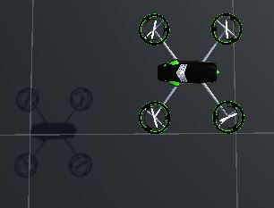

# EscapeTheDrones

## Description du scénario

Le joueur incarne un personnage, une capsule rouge. Le but est de se déplacer jusqu'à trouver un disque vert : une fois que le joueur est parvenu à aller dans ce disque,
il a gagné. Ceci dit, il n'est pas évident de le repérer car la caméra (en vue à la première personne) est assez basse et ne permet donc pas de le distinguer de loin.
De plus, la position du joueur mais aussi du disque vert sont aléatoires sur une carte de 130m x 130m (1,7 hectare).

Cependant la vraie difficulté réside en le fait que 4 drones de surveillance patrouillent la carte : si l'un d'eux détecte le joueur, il va avertir une équipe de 3 robots snipers
qui vont tirer sur le joueur toutes les 2 secondes tout en se déplaçant vers lui. Si les dégats sont inversement proportionnels à la distance entre un robot et le joueur, ce dernier
n'a que 300 points de vie ; il ne faut donc pas trop laisser les robots se rapprocher ou alors se cacher derrière l'un des 30 murs placés aléatoirement sur la carte.

Dès lors que le joueur est détecté par au moins un drone, il peut alterner entre la vue à la première personne et une vue globale aérienne en appuyant sur la touche 'C'.
Cela dit en vue aérienne, puisqu'il est facile de situer le cercle vert, la vitesse est divisée par 2,5.

Il est d'ailleurs possible de modifier la vitesse du joueur grâce à des bonus eux aussi placés aléatoirement. Ces bonus de vitesse prennent la forme de sphères bleues et augmentent de
50% la vitesse du joueur et sont cumulables.
Il existe aussi des sphères noires, plus rares, qui permettent de stopper tous les drones et robots actifs pendant une durée de 5 secondes.

Le disque vert à atteindre pour remporter la partie

Un des drones qui surveille sa zone en volant à une altitude de plusieurs mètres

Une des équipes de robots attendant patiemment d'être réveillée

Dans cette courte partie, le joueur se fait rapidement détecter par le drone 2 (en jaune) puis par le drone 3 (en noir). Sentant que ses secondes sont comptées, le joueur décise de presser la touche 'C' pour passer en vue aérienne et assure la victoire en consommant une sphère noire, stoppant dans leur élan tous les drones et robots actifs pendant une durée de 5 secondes.

## Implémentation du projet

### Les scripts

Pour faire ce projet, trois scripts ont été nécessaires :
- Player.cs qui va principalement permettre au joueur de se déplacer, mais qui va également gérer les intéractions avec plusieurs objets comme le disque vert ou encore les bonus bleus et noirs.
- Drone.cs qui va gérer les différents comportements de chaque drone : la délimitation de sa zone de patrouille, la vitesse à laquelle il va (qui peut varier selon la surface qu'il a à surveiller),
son parcours qui est aléatoire au sein de sa zone mais également la manière d'envoyer des raycasts et d'agir en fonction de ce qu'il détecte.
- Robot.cs qui gère le comportement des robots lorsqu'ils doivent infliger des dégats au joueur. Ils doivent notamment tenir compte d'éventuels murs entre eux et le joueur, auquel cas ils ne peuvent pas tirer.

### Déplacement du joueur

En vue à la première personne, il faut appuyer sur la touche 'W'. Cependant, il était difficile de se contenter de `Input.GetKeyDown(KeyCode.W)` ou `Input.GetKeyUp(KeyCode.W)` car il fallait alors appuyer de nombreuses fois pour avancer un petit peu, dû à la fréquence de l'appel de Update(). J'ai alors eu l'idée de passer un booléan à `true` lorsque Input.GetKeyDown(KeyCode.W) est vrai, et d'effectuer le déplacement à chaque itération avec `this.transform.position += this.transform.forward * this.speed/10 * Time.deltaTime;`. Dès que Input.GetKeyUp(KeyCode.W) est à true, cela signifie que l'utilisateur a lâché la pression sur le bouton 'W' et je passe alors le booléen à `false`, arrêtant ainsi le mouvement.
Pour ce qui est de la caméra, le déplacement horizontal de la souris est mesuré avec `Input.GetAxis("Mouse X")`. La rotation sur l'axe y est alors décrémentée du produit de cette mesure de la souris par un facteur de vitesse déterminé dans les attributs de la classe. Il suffit alors d'effectuer la rotation de la caméra en attribuant à la `transform.localRotation` la valeur de `Quaternion.Euler(0f, -1f * rotationY, 0f)`.

En vue aérienne, le principe de l'appui des touches est également utilisé sauf qu'ici ce n'est plus la touche W qui produit un déplacement. Puisque la vue est globale (et donc éloignée du sol), il est très dur voire impossible de repérer l'avant ou l'arrière du personnage. De ce fait, le déplacement est géré par les flèches haut, bas, gauche et droite pour déplacer le joueur respectivement vers l'avant avec `Vector3.forward`, l'arrière avec `Vector3.back`, la gauche avec `Vector3.left` et la droite avec `Vector3.right`. La caméra est quant à elle fixée à une certaine hauteur telle qu'elle peut voir l'entièreté de la carte en étant orientée à 90 degrés sur l'axe des abscisses.

### Déplacement des drones et détection via raycasts

Les drones se voient attribués (dans `Start()`) une zone qu'ils vont devoir surveiller. Cette attribution est faite par le code mais utilise des tags préalablement créés manuellement via l'inspecteur. Ainsi, ajouter un autre drone sans ajouter un tag produirait des disfonctionnement dans la patrouille de ce drone. De plus, dans le code, des variables très spécifiques au nombre de drones sont utilisées : puisqu'il y a 4 drones, la carte est divisée en 4 par le produit entre la taille de la carte et des facteurs uniques à chaque drone. Si on veut modifier le nombre de drones, il faut alors modifier le code.
Ce nombre de drones est possiblement la seule variable fixée à l'avance : si on voulait, on pourrait très bien ajouter autant de cercles verts, de murs ou de robots qu'on voudrait sans que ça soit un problème pour le fonctionnement du jeu.

Chacune des zones de patrouille est un rectangle de la longueur de la carte et avec un largeur valant un quart de cette carte. 

Toutes les 5 secondes, chaque drone va effectuer un rotation sur l'axe y grâce à l'appel de la méthode `RotationDroneRandom()`. Cette valeur de rotation peut prendre les valeurs 0, 90, 180 ou 270. Ainsi il peut faire une rotation dans n'importe quelle direction ou peut continuer dans la même qu'avant la rotation.
Puisque les zones sont assez étroites en comparaison avec la longueur, cette dernière est généralement privilégiée : si le drone se déplace dans la direction de la longueur (quel que soit le sens), il a plus de chances de continuer tout droit. Spécifiquement, un drone se déplaçant dans cette direction a 50% de probabilité d'en changer.
Aussi, la méthode `Mathfs.Clamp` est utilisée pour garder un drone dans sa zone : s'il se rapproche un peu trop d'une des limites à telle point qu'il se retrouve à une distance inférieure à 2 mètres, il est remis à sa place et effectue une nouvelle rotation aléatoire.
Ainsi, en jeu, il est possible de conjecturer leur future trajectoire en pronostiquant qu'il vont continuer d'aller tout droit, mais il y a toujours un risque qu'au dernier moment ils changent totalement de direction.

A chaque itération de `Drone.Update()`, la méthode `DetectionLaser()` est appelée. Celle-ci permet au drone de lancer une multitude de raycasts au moyen de 2 boucles `for`. L'intersection entre ces rayons et le sol produit un carré de 10 mètres de côté. 

Ces rayons sont particulièrement envoyés sur la couche 8, celle sur laquelle se trouve le joueur. Ainsi, si `Physics.Raycast(ray, out hit, range, layer_mask)` vaut `true`, cela signifie qu'un rayon est entré en contact avec le joueur et que ce dernier se trouve alors juste en-dessous du drone. 
Ce drone a alors 2 missions : la première est de prévenir les autres drones qu'il a détecté le joueur et qu'il ne peut plus patrouiller : les autres drones vont alors se partager la zone laissée à l'abandon. Plus spécifiquement toutes les zones vont être recalculées pour être partagées équitablement entre tous les drones restants.
La deuxième mission du drone consiste à aller jusqu'à un point se trouvant au-dessus de son équipe de robots appelé le HQ (quartier général) avant de réveiller les dits-robots. Sur les axes X et Z, le HQ est placé à la position moyenne des robots de l'équipe et à la même altitude que le drone.
Ces deux missions font respectivement appel à deux méthodes très importantes de la classe Drone :
- `AdvancedRepartition()` : Elle est appelée dès la détection du joueur par un drone. Grâce à une liste contenant tous les drones (dont le drone qui appelle `AdvancedRepartition()`), le drone se retire de sa liste de drones ainsi que de celle des autres drones puis appelle `InitZoneLimit` qui va recalculer les zones des drones restants.
Contrairement à une version antérieure (trouvable sur le dépot sous le nom de `IntelligentRepartition()`), cette modification des zones est dynamique car elle ne dépend pas du nombre de drones. Pour ajouter un drone patrouilleur, il suffit simplement de créer un nouveau drone et de lui attribuer un nouveau tag (et des robots ayant le même tag si l'on veut qu'il fasse quelque chose après la détection).
- `AwakeRobots()` : Elle est appelée une fois que le drone a rejoint le quartier général. Ce dernier va alors réveiller tous les robots de la liste de son équipe en passant l'attribut `isActive` de chacun de ces robots à `true`. Il va aussi leur confier les deux masques à prendre en compte pour leur mission : `layer_mask` qui va permettre de lancer des raycasts dans la couche où se trouve le joueur, et `layer_mask_wall` qui est le masque permettant aux robots de détecter les murs. Une fois que le drone a appelé `AwakeRobots()`, il reste au même point à altitude constante.

### Déplacement des robots et mise à feu via raycasts

A chaque itération de `Robot.Update()`, si l'attribut `isActive` est à `true`, un robot avance vers le joueur grâce à la méthode `MoveTowards`. Un robot a la capacité de lancer un unique rayon directement sur le joueur tant qu'il a un ligne de vue. Ainsi, si un mur se trouve entre le robot et le joueur, le robot ne pourra pas infliger des dégâts au joueur. Dans l'implémentation, le robot tire un raycast à la fois sur la couche du joueur et sur la couche du robot. le booléen renvoyé par le raycast du joueur est `true` mais que ce n'est pas le cas du booléen renvoyé par le raycast dans la couche du mur, alors le robot peut infliger les dégâts. Si les deux booléens sont `true`, le robot calcule alors la distance entre le mur et lui puis le joueur et lui : si la première distance est plus grande que la deuxième, cela signifie que le mur est derrière le joueur et qu'il peut donc tirer. Sinon, cela signifie que le mur bloque la ligne de vue et que le robot ne peut alors pas tirer.
Après chaque tir de rayon, un timer de 2 secondes est utilisé pour rendre le jeu un tant soit peu jouable.

Pour ce qui est des dégâts infligés par les robots, ils sont inversement proportionnels à la distance entre le joueur et les robots. En partant d'une base de 600 HPs en dommages (le joueur n'a que 300 HPs), il faut multiplier cette base par l'inverse de la distance. Ainsi si la distance est notée `d`, les dégâts totaux sont de `600/d`.*
Par conséquent le montant minimal de dégat d'un robot peut être obtenu en plaçant un robot et le joueur dans deux coins opposés de la carte. Avec une carte de 130 mètres de côtés, la longueur de la diagonale vaut `sqrt(130² + 130²)` soit 183,85 mètres. `Puisque 600 / 183,85` vaut 3,26 et que l'on prend la valeur entière pour les dégâts totaux, un robot peut infliger au minimum 3 points de vie de dommage au joueur.

Quant à la quantité maximal de dégâts qu'un robot peut infliger, il faut considérer la distance minimale possible.
Un robot et le joueur étant des objets rigides, il est impossible qu'ils soient exactement à la même position (évitant ainsi une division par 0 dans le calcul des dégâts). La distance minimale est alors la somme des moitiés des diamètres du robot et du joueur qui peuvent être vus comme des cylindres. Ainsi `d = 1/2 + 1/2 = 1` mètre.
De ce fait un robot peut infliger au maximum `600 * 1/1 = 600` de dégâts au joueur, soit deux fois plus que le nombre de HPs qu'il possède.

## Présentation d'un concept d'Unity : le canvas

Avec Unity, l'interface utilisateur (UI) est synonyme de canvas. C'est un rectangle qu'il est possible d'adapter à l'écran de d'appareil lançant la simulation et sur lequel il est possible d'ajouter des éléments de l'UI en tant que fils. Tous ces éléments sont automatiquement placés dans une couche appelée `"UI"`.
A même le canvas, l'élément le plus fréquemment ajouté est le panel. Cela dit, dans ce projet, la jauge de vie du joueur vient elle aussi se placer directement sur le canvas.

S'il est coutume de ne placer qu'un panel par canvas et de créer un canvas par scène puis de faire en sorte de changer de scène par l'appui d'un bouton, ce n'est pas ce qui a été fait dans ce projet.
En effet, il n'y a ici qu'un seul et unique canvas accueillant pas moins de 4 panels différents.
Pour n'en afficher qu'un à la fois, la méthode `GameObject.SetActive` est beaucoup utilisée. Par rapport à l'utilisation de plusieurs scènes, cette méthode a l'avantage de ne pas nécessiter l'utilisation fréquente de la méthode `DontDestroyOnLoad` sur les objets de la scène principale.

Dans EscapeTheDrones, le panel actif au début de la partie est `Start`, sur lequel la présentation du scénario ainsi que les règles sont inscrites. Dès que la touche `Esc` est pressée, le panel est rendu inactif alors que la jauge de vie `Slider` et le panel `Log` sont eux rendus actifs. `Log` est un petit panel qui vient se mettre dans le coin inférieur droit de l'écran de l'utilisateur. Les communications entre les drones y sont affichées et l'utilisateur est également notifié qu'il peut passer en vue aérienne s'il le souhaite. Si les robots parviennent à disposer du joueur, le drone qui commande les robots l'ayant vaincu se vante de sa réussite dans `Log` avant que le panel `GameOver` soit rendu actif après quelques secondes. Ce menu sert d'une part à notifier l'utilisateur de sa défaite, mais aussi à lui proposer de rententer sa chance en appuyant sur la touche 'G'.
Dans le cas où le joueur a réussi à atteindre le disque vert avant de se faire éliminer par les robots, c'est le panel `Success` qui devient actif et qui, à l'instar du panel `GameOver` notifie l'utilsateur de sa victoire et lui propose de rejouer en pressant là encore 'G'.

## Problèmes d'implémentation et bugs

Lorsque le joueur consomme un bonus en entrant en contact avec une sphère bleue ou une sphère noire, une exception est lancée mettant en garde le fait de modifier des collections. Ceci-dit les sphères fonctionnent tout de même parfaitement et cela ne pose pas de problème pour l'exécutable.

Un autre soucis concerne justement la sphère bleue permettant d'augmenter la vitesse du joueur. 
Lorsque le joueur atteint une vitesse particulièrement élevée (à partir de 2 sphères bleues consommées), il passe à travers les murs. Ce problème persiste même en ajoutant un composant `RigidBody` à chaque mur et en leur attribuant des masses de plusieurs tonnes.

Enfin, il y a un dernier bug assez rare et très difficile à reproduire. Parfois, un drone s'arrête à l'une des limites de sa zone de patrouille et ne se déplace plus, tout en continuant d'effectuer des rotations aléatoires. Lorsque cela arrive, il n'est pas capable de se dégager de cette situation et il faut alors passer sous ses raycasts pour qu'il se déplace comme si de rien n'était à son quartier général. 
Dans des cas encore plus rares, un drone peut se dégager lui-même de sa situation puis de reprendre ses fonctions normalement.

Nota Bene : l'exécutable porte le nom de `Turn-based fight.exe` car c'était à l'origine le nom du projet avant que le concept d'EscapeTheDrones ne soit trouvé. 

## Sources

- https://github.com/tdeporte/Unity_FPS : inspiration du dépot git de Tom et Axel pour mettre en place dans ce projet les raycasts ainsi que la vue en FPS.

- https://www.youtube.com/watch?v=v1UGTTeQzbo : quelques éléments de la vidéo 2D Character Health Bars in Unity / 2021 par Distorted Pixel Studios ont été utilisés pour créer un slider prenant le rôle d'une barre de vie en haut à gauche de l'écran.

- https://github.com/amassonie/unitydemo_raycast : toute ressemblance avec les robots du projet d'Alexandre, Alexis et Clément est justifiée car il s'agit bel et bien du même prefab.

- https://assetstore.unity.com/packages/3d/vehicles/air/simple-drone-190684 : ce modèle a été utilisé pour les drones.